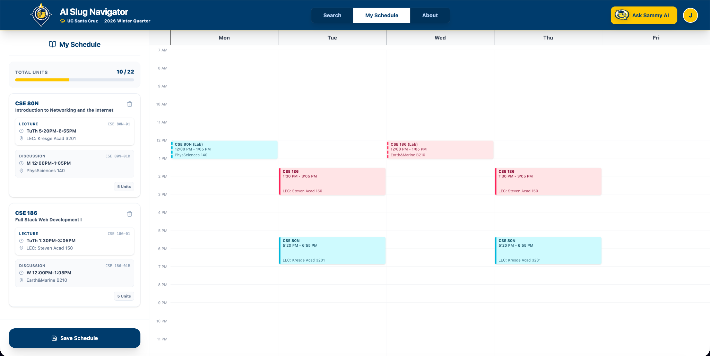

# 🐌 AI Slug Navigator

> **The smartest way for UC Santa Cruz students to build their class schedule.**

 

## 📖 Project Overview
**AI Slug Navigator** is a full-stack **React** and **Node.js/Express** web application that simplifies course planning for UCSC students, using Supabase Google OAuth to let students save and revisit schedules..

It acts as a centralized dashboard that unifies **MyUCSC course data**, **RateMyProfessors ratings**, and **Google Gemini AI** into a single interface. Instead of juggling multiple tabs to cross-reference class times and professor reviews, students can search and filter courses, visualize their weekly schedule, and ask an AI Academic Advisor for recomendations.

---

## 🚀 Key Features

* **🤖 AI Academic Advisor:** Chat with "Sammy AI" (powered by Gemini 2.5) to find classes based on your interests (for example, "Find me an easy GE for Arts credit").
* **📅 Smart Schedule Builder:** Add and drop classes. The app automatically blocks time conflicts and calculates unit totals.
* **⭐ RMP Integration:** See RateMyProfessors ratings and difficulty scores directly on the course card.
* **⚡ Real Time Search:** Instant search across thousands of courses with best match sorting.
* **🔒 Privacy First:** Uses Google OAuth (Supabase) for secure login. We never sell student data.

---

## 🤖 How it Works (RAG)
Unlike standard chatbots, this app uses **RAG (Retrieval-Augmented Generation)** to ground responses in the current course catalog and your in-progress schedule.

* **Catalog aware:** Suggestions are based on the latest scraped course data, including availability status when provided.
* **Schedule aware:** It considers the schedule you are building and avoids recommending time conflicts.
* **Prerequisite aware:** It reads prerequisite text and course descriptions to warn about missing requirements.

---

## 📸 Screenshots

| **Smart Search & Filters** | **AI Schedule Builder** |
|:---:|:---:|
|  |  |

---

## 🛠️ Tech Stack

### Frontend
* **React + Vite**
* **Tailwind CSS**
* **Lucide React** (icons)

### Backend
* **Node.js + Express**
* **Google Gemini 2.5 Flash** (chat assistant)
* **Cheerio** (UCSC catalog scraper)

### Database and Auth
* **Supabase** (PostgreSQL + Google OAuth)
* **Prisma ORM**

---

## 💻 How to Run Locally

### 1. Clone the Repo
```bash
git clone https://github.com/jack-dao/ai-course-navigator.git
cd ai-course-navigator
```

### 2. Backend Setup
```bash
cd backend
npm install

# Create a .env file with your keys:
# DATABASE_URL="your_supabase_url"
# GEMINI_API_KEY="your_google_key"
# PORT=3000

node server.js
```

### 3. Frontend Setup
```bash
# Open a new terminal window
cd frontend
npm install
npm run dev
```

Visit `http://localhost:5173` to start building your schedule! 🐌

---

## ⚖️ Disclaimer
This project is a student built tool and is not affiliated with the University of California, Santa Cruz. Course data is scraped from public listings and may not reflect real time changes in MyUCSC.

## 🤝 Contributing
Found a bug? Open an issue or submit a pull request!
